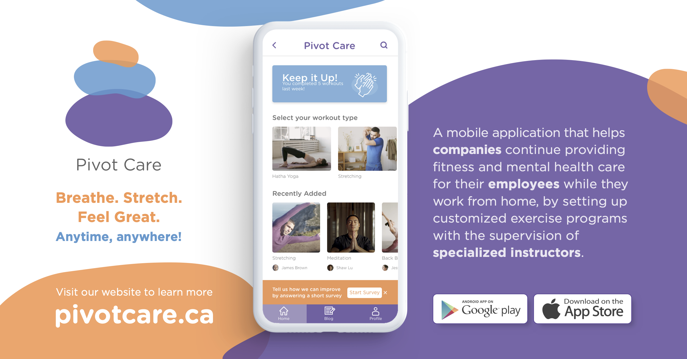
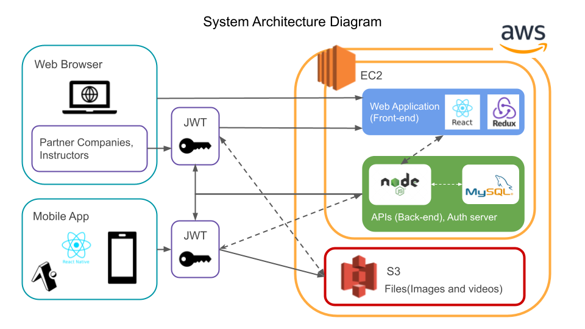
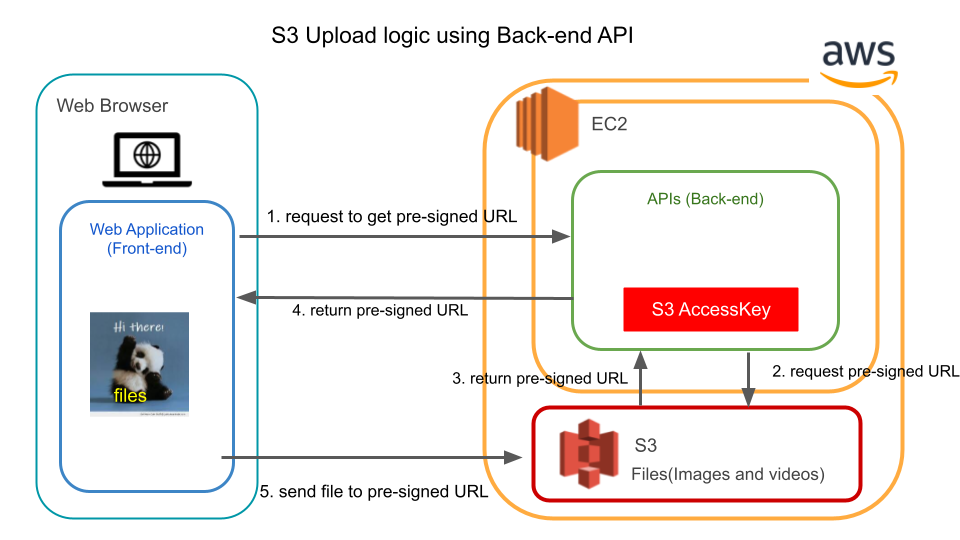

🚧️ This app is still WIP 🚧️
# About

## 👆Click an Above Image to Play a Promotion Video!!!
(This image and video were created by awesome designers. If you get interested in who created design materials, please check the team member section of this link https://pivotcare.ca/about)

Pivot Care is a mobile application that helps companies to continue providing fitness and mental health care for their employees while they working from home.
This web application has been created for both advertising and configuration purposes. Users(companies and instructors) can create their own account and manipulate data on their configuration page.
(This project is for portfolio and investigation not for release or monetize.)

# Why I (our team) created this web application
I created this web app to show my development skill.

I can create an interactive UI using ReactJS with several technology, such as MaterialUI and Redux.

I am able to handle multiple HTTP requests and display the results because of the well-understanding of the React component lifecycle and the concept of the component tree.

Moreover, I have created a part of the server-side program. For example, I was responsible for creating an API for uplaoding files to AWS S3 Strage and authentication and athorization functions using Json Web Token.

# System Architecture

## Infrastracture
To deploy the web app, I am using AWS EC2. I have set up Node.js webserver and MySQL database server on it. Moreover, some other networking settings have been done at the same time, such as reverse proxy, firewall and ssl.
To automate a deployment process, I have adopt CodePipeline and CodeDeploy, which connect a GitHub repository and EC2.

## Front-end
In the front-end development, I utilized modern web develpment technology, such as ReactJS, Redux and MaterialUI to implement interactive user interface. To manage users' login condition, I used Redux and change the UI accordingly.

## Back-end
Our API server is created by using Node.js and MySQL.
### Authentication and Authorization
I have developed authentication and authorization functionality to implement a login function on front-end. JWT is used to issue token, and a token validation is applied to APIs which return confidential information.
### File Upload to S3

To allow users to upload image and video files to S3, I have created an endpoint to send pre-signed URL to a user, which can be used to upload files. 
